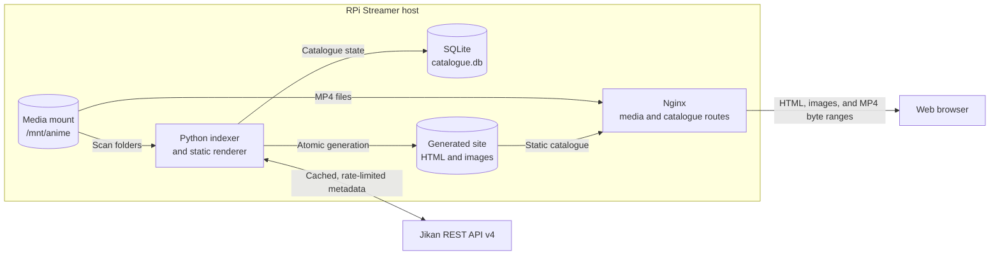

# RPi Streamer

RPi Streamer is a small, local-network media catalogue for personal MP4
collections. Nginx serves the media files with HTTP byte-range support so a
browser can seek and stream without downloading an entire file first. A
periodic Python indexer scans the library, stores its catalogue in SQLite,
enriches anime folders with metadata, and generates static HTML pages for
Nginx to serve.

The project is intended to run comfortably on a Raspberry Pi. It does not
transcode video, manage users, or expose a public internet service.

> **Project status:** Steps 1–8 are complete. The installable CLI,
> configuration layer, versioned SQLite repository, and read-only filesystem
> scanner with cached Jikan enrichment and atomic static catalogue generation
> are available with periodic and signal-triggered service operation and an
> Nginx configuration for static catalogue and MP4 range serving, and a
> hardened native systemd deployment. See
> [PLAN.md](PLAN.md) for tracked progress.

## Goals

- Stream existing `.mp4` files through Nginx, including browser seeking.
- Browse folders, series, related titles, genres, and locally available
  episodes from generated pages.
- Detect additions, changes, moves, and removals during periodic scans.
- Cache catalogue and metadata state in SQLite.
- Fetch anime details, cover art, episode information, genres, and
  prequel/sequel relationships without requiring a MyAnimeList login.
- Run as a native systemd service or in containers.
- Configure the same application with an INI file and environment variables.
- Continue serving the last successful catalogue when scanning or metadata
  lookup fails.

## Non-goals

- Video transcoding, remuxing, or adaptive-bitrate streaming.
- Authentication, authorization, or safe exposure to the public internet.
- Editing a MyAnimeList account or watch history.
- Downloading copyrighted media.
- A heavy, always-running application web framework.

MP4 browser compatibility still depends on the codecs in each file. Nginx can
serve any MP4, but common browser-compatible combinations such as H.264 video
and AAC audio provide the broadest playback support.

## Proposed architecture



Nginx is the data plane: it handles large files, MIME types, conditional
requests, and byte ranges efficiently. Python is the control plane: it scans
and generates pages, but is not in the video path. Static generation is
preferred over FastAPI because the catalogue changes infrequently and requires
no authentication or per-user state. A dynamic API can be added later without
changing media URLs.

The implementation uses the public, read-only
[Jikan REST API v4](https://docs.api.jikan.moe/) as the default metadata
provider. Jikan is an unofficial MyAnimeList API, supports conditional
requests, and currently documents limits of 3 requests/second and 60
requests/minute. RPi Streamer sends at most one request per second per process,
uses a descriptive user agent and 10-second timeout, persists fetched
responses, honors `ETag`/`Last-Modified`, and makes at most three attempts with
bounded backoff for `429` and transient `5xx` responses. Metadata availability
is never required for local playback.

### Metadata matching and caching

New, unpinned folders are searched by their display title. Matching normalizes
Unicode, case, punctuation, and whitespace, then scores the canonical and
alias titles. A candidate must score at least `0.88` and lead the next result
by at least `0.08`; otherwise the title remains visibly unmatched rather than
being assigned speculatively. Equal top results are always ambiguous.

The selected anime's title, synopsis, episode count and episode rows, aliases,
genres, anime relations, raw diagnostic response, validators, and cover
reference are stored in SQLite. Fresh records make no network request. Records
older than `metadata_refresh_interval` are refreshed conditionally; a `304`
advances the cache timestamp without replacing normalized data. Set
`metadata_provider = none` for entirely offline scans.

`metadata_language` selects the cached canonical title when Jikan provides a
matching English (`en`/`eng`) or Japanese (`ja`/`jp`/`jpn`) alias, falling back
to Jikan's default title. A sidecar `mal_id` bypasses search and confidence
matching. `metadata_enabled = false` prevents all metadata requests for that
folder.

When enabled, covers are limited to HTTP(S), known image MIME types, and 5 MiB.
They are atomically cached under `state_dir/artwork`; a failed download stores
a missing-art marker for the renderer's future placeholder. Provider,
payload, and artwork errors are isolated per title and included in the scan's
`partial` summary. Previously cached metadata and all local media remain
available.

## Expected library layout

The scanner treats each directory containing one or more `.mp4` files as a
title. The extension match is case-insensitive, so `.MP4` is accepted. A
folder name is converted into its candidate title by replacing dots and
underscores with spaces and collapsing whitespace; other punctuation is
retained. Nested title directories are supported. Media filenames use
case-insensitive natural order, so `2.mp4` sorts before `10.mp4`.

```text
/mnt/anime/
├── Cowboy Bebop/
│   ├── 01 - Asteroid Blues.mp4
│   ├── 02 - Stray Dog Strut.mp4
│   └── rpi-streamer.ini        # optional per-title overrides
└── Neon Genesis Evangelion/
    ├── S01E01.mp4
    └── S01E02.mp4
```

Folder names are used as search hints, not unquestioned identities. The
original filename remains the authoritative episode label. The scanner also
stores conservative hints for a leading number or range, `S01E02` and episode
ranges, and `OVA`/`OAD`/`ONA`/`Special` forms. It does not infer an episode
number from an arbitrary number embedded in a title.

An optional UTF-8 `rpi-streamer.ini` in a title directory supports:

```ini
[rpi-streamer]
display_title = Cowboy Bebop
sort_title = Bebop, Cowboy
metadata_enabled = true
mal_id = 1
```

All keys are optional. `display_title` and `sort_title` must be non-empty when
present, `metadata_enabled` uses the same boolean forms as the main config,
and `mal_id` must be a positive integer. A MAL pin is stored for the `jikan`
provider. Unknown sections/keys and malformed values are reported as scan
errors; safe folder-derived defaults are still catalogued.

Directory symlinks are not traversed. File symlinks are catalogued only when
their resolved target remains inside `media_root`; escaping links are reported
and skipped. Duplicate links to the same filesystem object are skipped. The
scanner only reads the media tree and never creates sidecars or other files in
it.

## Generated catalogue

The implemented UI is server-rendered static HTML with no JavaScript, frontend
build tool, CDN, or request-time Python process:

- a home page with title cards, cover images, and scan status;
- a folder/title page with metadata and locally available MP4 episodes;
- genre pages and links between known prequels and sequels;
- semantic breadcrumbs and primary navigation;
- an HTML5 `<video controls preload="metadata">` player;
- graceful placeholders when metadata or artwork is unavailable.

Only currently available local files receive players. Provider episode rows
are shown in a separate reference table and never imply local availability.
All user-controlled filenames and remote text are HTML-escaped. Every media
path segment is URL-encoded and rooted below `/media/`; remote artwork URLs are
never emitted into pages.

Title pages use database-identity slugs such as
`titles/title-00000001.html`, independent of display titles. Genre pages use a
readable prefix plus a hash suffix to prevent normalization collisions. A
generated tree looks like:

```text
site/
├── index.html
├── assets/
│   ├── style-<content-hash>.css
│   └── covers/
│       └── jikan-1-<content-hash>.jpg
├── titles/title-00000001.html
└── genres/
    ├── index.html
    └── sci-fi-96dee9f018.html
```

For example, a local file is rendered as a native browser player with an
encoded Nginx media route:

```html
<video controls preload="metadata"
       src="/media/Cowboy%20Bebop/01%20-%20Asteroid%20Blues.mp4">
  <p>Your browser cannot play this video.</p>
</video>
```

Generation happens in a sibling staging directory. Required output is
validated before the complete tree is atomically renamed to `site_dir`. On
subsequent successful builds, the formerly published tree is retained as
`<site_dir>.previous`. Rendering, validation, and publication failures leave
the currently published site intact. Output bytes are deterministic when the
catalogue and cached assets are unchanged.

CSS and validated cover images have content-derived filenames. This lets Nginx
cache them as immutable for a year without serving stale content after a
change. HTML retains stable URLs and is always revalidated.

## Installation for development

RPi Streamer requires Python 3.11 or newer and currently has no runtime
dependencies. From an activated virtual environment:

```bash
python -m pip install -e '.[dev]'
rpi-streamer --help
```

The `dev` extra installs pytest, Ruff, and mypy. An editable install without
development tools is `python -m pip install -e .`.

## Configuration

Native installations read `/etc/rpi-streamer/rpi-streamer.ini`. A different
file can be selected with `RPI_STREAMER_CONFIG` or the higher-precedence
`--config PATH` CLI option. Setting values use this precedence:
environment variable, INI value, built-in default. The example file is
[`config/rpi-streamer.ini.example`](config/rpi-streamer.ini.example).

The implemented schema is:

```ini
[rpi-streamer]
media_root = /mnt/anime
state_dir = /var/lib/rpi-streamer
site_dir = /var/lib/rpi-streamer/site
database_path = /var/lib/rpi-streamer/catalogue.db
scan_interval = 1h
metadata_provider = jikan
metadata_refresh_interval = 30d
metadata_language = en
download_artwork = true
log_level = INFO
```

| INI key | Environment override | Purpose |
|---|---|---|
| `media_root` | `RPI_STREAMER_MEDIA_ROOT` | Read-only root containing the collection |
| `state_dir` | `RPI_STREAMER_STATE_DIR` | Persistent application state |
| `site_dir` | `RPI_STREAMER_SITE_DIR` | Atomically published static catalogue |
| `database_path` | `RPI_STREAMER_DATABASE_PATH` | SQLite database file |
| `scan_interval` | `RPI_STREAMER_SCAN_INTERVAL` | Delay between automatic scans; `0` disables them |
| `metadata_provider` | `RPI_STREAMER_METADATA_PROVIDER` | `jikan` or `none` initially |
| `metadata_refresh_interval` | `RPI_STREAMER_METADATA_REFRESH_INTERVAL` | Maximum metadata cache age |
| `metadata_language` | `RPI_STREAMER_METADATA_LANGUAGE` | Preferred display-title language |
| `download_artwork` | `RPI_STREAMER_DOWNLOAD_ARTWORK` | Cache covers locally |
| `log_level` | `RPI_STREAMER_LOG_LEVEL` | Application log verbosity |

Durations accept a non-negative integer with an optional `s`, `m`, `h`, or `d`
suffix; a bare integer is seconds. Boolean values accept
`1/0`, `true/false`, `yes/no`, and `on/off`, case-insensitively.

Configuration validation currently enforces:

- an existing, readable, absolute media root;
- absolute, distinct state/site/database paths with writable existing
  ancestors;
- state, site, and database paths outside the media root;
- `jikan` or `none` as the metadata provider;
- a positive metadata refresh interval and a non-negative scan interval;
- a short language identifier and a standard Python log level;
- known INI sections and keys, so misspellings fail at startup.

An explicitly selected config file must exist. The default file is optional,
allowing environment-only container configuration. `validate-config` emits the
normalized configuration as sorted JSON and returns exit code `2` for a
configuration error:

```bash
rpi-streamer --config ./config/rpi-streamer.ini.example validate-config
RPI_STREAMER_CONFIG=/path/to/rpi-streamer.ini rpi-streamer validate-config
```

The current settings contain no secrets; diagnostic output is designed to
remain safe if secret settings are introduced later.

## Process lifecycle

The indexer performs a scan at startup and then waits for the configured
interval:

- `SIGHUP` requests an immediate rescan (coalesced if one is already running);
- if `SIGHUP` arrives during a scan, exactly one follow-up scan runs;
- `SIGTERM` and `SIGINT` request shutdown after the active atomic scan cycle;
- a failed scan is logged and retried later while the previous generated site
  remains available.

Scheduling uses a monotonic clock, so wall-clock corrections do not cause
unexpected scans. `scan_interval = 0` keeps the startup and signal-triggered
scans but disables timed scans. An advisory lock at
`state_dir/indexer.lock` prevents `serve` and one-shot `scan` processes from
modifying the same state concurrently.

The installed CLI provides the planned foreground and one-shot command names:

```text
rpi-streamer serve
rpi-streamer scan
rpi-streamer validate-config
```

All three commands are operational. `scan`
creates/migrates the configured database, reconciles and enriches the
collection, atomically regenerates `site_dir`, prints a compact scan/page
summary, and returns `0` for a complete scan or `3` for a partial scan or
generation failure. Use `rpi-streamer scan --json` for a single-line,
machine-readable result. `serve` runs in the foreground for systemd or a
container. Argument/config errors return `2`; operational failures and partial
one-shot scans return `3`; lock contention returns `4`.

Service logs use concise `key=value` fields suitable for journald, including
`event`, `scan_id`, status, title/file/error counts, and generated page count.
Remote payloads are never logged and error values have control characters
removed. The atomically replaced `state_dir/status.json` health artifact
contains the PID, state (`starting`, `scanning`, `ready`, `degraded`, or
`stopped`), update time, and the latest successful summary when applicable.
A failed cycle publishes `degraded` and its sanitized error; a later
successful cycle returns it to `ready`.

For systemd, `systemctl reload rpi-streamer` will send `SIGHUP`. Scans will also
be triggerable with `kill -HUP "$(pidof rpi-streamer)"` where appropriate.

## Nginx streaming setup

The site template is
[`deployment/nginx/rpi-streamer.conf.template`](deployment/nginx/rpi-streamer.conf.template).
It has three placeholders:

| Placeholder | Example | Meaning |
|---|---|---|
| `__LISTEN__` | `192.168.1.20:8080` | LAN address and TCP port |
| `__SITE_ROOT__` | `/var/lib/rpi-streamer/site/` | Generated catalogue root, with trailing slash |
| `__MEDIA_ROOT__` | `/mnt/anime/` | Media alias root, with trailing slash |

Copy the template, replace every placeholder, and validate it before enabling
the site. For a Debian/Raspberry Pi OS installation:

```bash
sudo cp deployment/nginx/rpi-streamer.conf.template \
  /etc/nginx/sites-available/rpi-streamer.conf
sudo sed -i \
  -e 's|__LISTEN__|192.168.1.20:8080|g' \
  -e 's|__SITE_ROOT__|/var/lib/rpi-streamer/site/|g' \
  -e 's|__MEDIA_ROOT__|/mnt/anime/|g' \
  /etc/nginx/sites-available/rpi-streamer.conf
sudo ln -s /etc/nginx/sites-available/rpi-streamer.conf \
  /etc/nginx/sites-enabled/rpi-streamer.conf
sudo nginx -t
sudo systemctl reload nginx
```

Choose the host's actual private-LAN address; do not use `0.0.0.0` unless a
firewall restricts the port to trusted subnets. Do not port-forward the
service. The Nginx worker needs read and directory-traverse permission on the
generated site and media tree, but neither path needs to be writable by Nginx.
The media and site paths must be absolute, and the trailing slashes shown above
are significant for `root`/`alias` mapping.

Nginx serves only `.mp4` paths below `/media/`, blocks dotfiles and directory
listing, refuses media symlinks, and leaves byte-range handling to its normal
static-file module. There is no `mp4` pseudo-streaming directive and no
transcoding. HTML receives `Cache-Control: no-cache`; content-fingerprinted
CSS/covers receive a one-year immutable policy; media is revalidated. The
`/healthz` endpoint reports whether Nginx itself can answer requests. The
indexer's richer state remains in `state_dir/status.json`.

Useful checks after deployment are:

```bash
curl -i http://192.168.1.20:8080/healthz
curl -I http://192.168.1.20:8080/
curl -i -H 'Range: bytes=100-199' \
  'http://192.168.1.20:8080/media/Cowboy%20Bebop/01.mp4'
```

The range request should return `206 Partial Content`, a `Content-Range`
header, and exactly 100 bytes. An unsatisfiable range should return `416`.
If catalogue pages return `404`, confirm that a successful scan has generated
`site_dir` and that the configured path matches it. For media `403`/`404`
responses, inspect every parent directory's traverse permission and confirm
the file is a regular, non-symlinked MP4 under `media_root`. Use `nginx -T` to
inspect the effective configuration. Successful delivery with failed browser
playback usually indicates an unsupported codec rather than a range problem.
The generated catalogue remains fully browsable when the Python indexer is
stopped because Nginx reads only the last published static tree.

## Native Debian/Raspberry Pi OS deployment

The native artifact is a Python wheel plus the versioned files under
[`deployment/`](deployment/). The installer creates a dedicated virtual
environment instead of modifying the OS Python installation. On a clean
Debian 12 or Raspberry Pi OS Bookworm host, install the OS prerequisites and
build the wheel:

```bash
sudo apt update
sudo apt install python3 python3-venv nginx
python3 -m venv .build-venv
.build-venv/bin/python -m pip install --upgrade pip
.build-venv/bin/python -m pip wheel --no-deps --wheel-dir dist .
```

Run the installer with the wheel path and the host's private-LAN listen
address. It is intentionally not enabled automatically, so configuration and
permissions can be checked first:

```bash
sudo deployment/install.sh dist/rpi_streamer-*.whl 192.168.1.20:8080
sudoedit /etc/rpi-streamer/rpi-streamer.ini
sudo -u rpi-streamer \
  /opt/rpi-streamer/venv/bin/rpi-streamer validate-config
sudo nginx -t
```

The installed layout is:

```text
/etc/rpi-streamer/rpi-streamer.ini
/etc/nginx/sites-available/rpi-streamer.conf
/etc/systemd/system/rpi-streamer.service
/opt/rpi-streamer/venv/
/var/lib/rpi-streamer/
```

An existing INI is never overwritten during installation or upgrade. The
installer creates the `rpi-streamer` system account, state directory, unit,
Nginx site, and adds Debian's `www-data` account to the `rpi-streamer` group.
The latter change takes effect after Nginx is restarted.

### Media and generated-site permissions

Both the indexer and Nginx need read permission and directory traversal on the
media tree; neither needs write permission there. One suitable ownership model
is a trusted administrator as owner and `rpi-streamer` as the reader group:

```bash
sudo chgrp -R rpi-streamer /mnt/anime
sudo find /mnt/anime -type d -exec chmod 0750 '{}' +
sudo find /mnt/anime -type f -exec chmod 0640 '{}' +
namei -l /mnt/anime
sudo -u rpi-streamer find /mnt/anime -type f -name '*.mp4' -print -quit
sudo -u www-data find /mnt/anime -type f -name '*.mp4' -print -quit
```

Review these recursive permission commands before using them if the mount is
shared with other applications. Group membership avoids making the collection
world-readable or writable. Keep native media outside `/home`: the unit's
`ProtectHome=true` intentionally makes home directories inaccessible. The
whole service filesystem is read-only under `ProtectSystem=strict`, with only
`/var/lib/rpi-streamer` admitted through `ReadWritePaths`. `StateDirectory`
creates that path as `rpi-streamer:rpi-streamer` mode `0750`, and `UMask=0027`
makes generated pages group-readable for Nginx.

Start the services after the checks:

```bash
sudo systemctl enable --now rpi-streamer nginx
systemctl status rpi-streamer --no-pager
curl -i http://192.168.1.20:8080/healthz
```

Normal lifecycle and diagnostics are:

```bash
sudo systemctl start rpi-streamer
sudo systemctl stop rpi-streamer
sudo systemctl restart rpi-streamer
sudo systemctl reload rpi-streamer
sudo systemctl is-enabled rpi-streamer
journalctl -u rpi-streamer -n 100 --no-pager
journalctl -u rpi-streamer -f
systemctl show rpi-streamer -p User -p Group -p ReadWritePaths
```

`reload` sends `SIGHUP` and requests a scan without interrupting the active
one. Unexpected exits are restarted after ten seconds; deliberate stops are
not. Startup waits for `network-online.target` so Jikan refreshes do not race
basic network configuration. A long active scan receives up to five minutes
to finish cleanly during shutdown.

### Upgrade, backup, rollback, and uninstall

Build a new wheel from the desired revision and rerun `deployment/install.sh`;
it upgrades the isolated environment and preserves the INI. Then validate and
restart:

```bash
sudo -u rpi-streamer \
  /opt/rpi-streamer/venv/bin/rpi-streamer validate-config
sudo systemctl restart rpi-streamer
```

For a consistent backup, briefly stop writes and archive the complete state
(database, artwork, status, and last generated site):

```bash
sudo systemctl stop rpi-streamer
sudo tar -C /var/lib -czf rpi-streamer-backup.tgz rpi-streamer
sudo systemctl start rpi-streamer
```

To restore, stop the service, move the current state aside, extract the archive
under `/var/lib`, restore `rpi-streamer:rpi-streamer` ownership, and start the
service. A version rollback uses the same installer with an older wheel.
Database migrations are forward-only, so restore the backup taken before an
upgrade if the older version does not understand the newer schema.

To uninstall the executable and service while retaining the collection and
state:

```bash
sudo systemctl disable --now rpi-streamer
sudo rm /etc/systemd/system/rpi-streamer.service
sudo rm /etc/nginx/sites-enabled/rpi-streamer.conf
sudo rm /etc/nginx/sites-available/rpi-streamer.conf
sudo rm -r /opt/rpi-streamer
sudo systemctl daemon-reload
sudo systemctl reload nginx
```

`/etc/rpi-streamer`, `/var/lib/rpi-streamer`, and the system account are
deliberately retained for recovery. Remove them only after verifying a backup.
The media collection is never removed by the installer or these commands.

This is intentionally a trusted-LAN design. Operators should use a firewall and
must not port-forward it to the internet without adding authentication, TLS,
request limits, and a separate security review.

## Container deployment target

The planned Compose setup uses two small services:

- `indexer`: the Python application with the media volume mounted read-only
  and state/site volume mounted read-write;
- `nginx`: the generated site and media volumes mounted read-only.

SQLite and generated output live in a persistent volume. Configuration is
provided through `RPI_STREAMER_*` variables. Containers share no Docker socket
and run without privileged mode. Multi-architecture images will target at
least `linux/amd64` and `linux/arm64`.

## Data and rescan behavior

The implemented repository uses Python's standard `sqlite3` module without an
ORM. Opening `CatalogueRepository(database_path)` creates the parent directory,
opens the database, applies pending migrations, and exposes typed records
instead of requiring application code to issue SQL.

Schema version 3 contains:

| Table | Stored data |
|---|---|
| `schema_migrations` | Applied forward-only schema versions and UTC timestamps |
| `library_entries` | Title folders, display/sort titles, availability, and metadata overrides |
| `media_files` | Relative MP4 paths, filesystem identity, size/mtime, episode hints, and availability |
| `provider_records` | Normalized title details, provider IDs, cache validators, refresh time, and compact raw detail JSON |
| `provider_episodes` | Provider episode number, title, air date, filler, and recap flags |
| `aliases` | Provider title aliases by type |
| `genres` / `provider_record_genres` | Case-insensitive normalized genres and title membership |
| `relations` | Prequel, sequel, and other provider relationships |
| `artwork` | Source/cache paths, MIME/size details, and HTTP validators |
| `scan_runs` | Running/completed scan status, counts, summary, and errors |

Media and artwork paths are canonical relative POSIX paths. Absolute paths,
backslashes, `.`/`..`, repeated separators, and NUL bytes are rejected.
Persisted timestamps are timezone-aware and normalized to UTC. Files have a
local identity derived from the filesystem device and inode, allowing a rename
or move on the same mounted filesystem to retain its database row and title
metadata where the match is unambiguous. Size and nanosecond modification time
detect content changes. Videos are not hashed.

Foreign keys and a 5-second busy timeout are enabled on every repository
connection. The repository requests WAL journal mode for normal file-backed
deployments and records the mode SQLite actually returns; SQLite may retain a
safer supported mode for in-memory databases or filesystems where WAL is not
available. Callers can wrap a full scan or metadata update in
`repository.transaction()`. Nested write methods use savepoints, and failed
replacements restore the previous rows.

Migrations are ordered, forward-only, idempotent, and applied transactionally.
A database with a schema newer than the application supports is rejected
instead of being modified. A successful full scan marks missing files and
entries unavailable rather than deleting them, preserving remote metadata and
history. If any directory, file, or sidecar could not be read safely, the scan
is recorded as `partial`: known-good discoveries are updated, but unseen rows
remain available so an unreadable subtree cannot erase the previous
catalogue. Remote calls occur only for new, manually rematched, or stale
titles, and failures do not discard the last cached provider record.

### Database backup and restore

Generated HTML is disposable, but `catalogue.db` contains mapping and cached
metadata state. For a consistent online backup, use SQLite's backup API or its
CLI `.backup` command rather than copying only the main file while WAL is
active:

```bash
sqlite3 /var/lib/rpi-streamer/catalogue.db \
  ".backup '/path/to/backup/catalogue.db'"
```

Alternatively, stop the indexer before copying `catalogue.db` together with
any present `catalogue.db-wal` and `catalogue.db-shm` files. Restore only while
the indexer is stopped, keep a copy of the pre-restore state, and start the
same or newer application version so migrations can run safely.

## Development checks

The source uses a `src/rpi_streamer/` layout and tests live in `tests/`. Run all
implemented checks from the project virtual environment:

```bash
ruff check .
ruff format --check .
mypy
pytest
```

The normal test suite never contacts Jikan. An explicit, low-volume live smoke
test is available when troubleshooting provider connectivity:

```bash
RPI_STREAMER_LIVE_JIKAN=1 pytest tests/test_metadata.py::LiveJikanSmokeTest
```

`tests/test_nginx.py` always audits the rendered template. When an `nginx`
binary is on `PATH`, it additionally runs `nginx -t`, starts an isolated
loopback server, and verifies catalogue availability, HEAD and conditional
requests, Unicode MP4 URLs, `200`/`206`/`416`, byte-accurate seeking, MIME,
cache headers, and rejection of traversal, dotfiles, symlinks, and non-media
files.

The remaining fixtures, deployment assets, and acceptance tests are specified
in [PLAN.md](PLAN.md). The project follows this workflow for every milestone:

1. implement one tracked step and its tests;
2. run the checks appropriate to that step;
3. update this README with behavior that is now real;
4. update the status and notes in `PLAN.md`;
5. commit the cohesive change with a descriptive message.

Until a milestone is marked **Done**, its interface in this README is a design
target and may change during implementation.

## License

Licensed under the Apache License 2.0. See [LICENSE](LICENSE).
