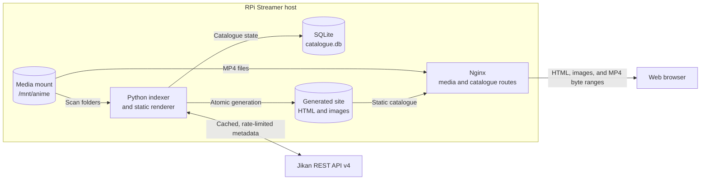

# RPi Streamer

RPi Streamer is a small, local-network media catalogue for personal MP4
collections. Nginx serves the media files with HTTP byte-range support so a
browser can seek and stream without downloading an entire file first. A
periodic Python indexer scans the library, stores its catalogue in SQLite,
enriches anime folders with metadata, and generates static HTML pages for
Nginx to serve.

The project is intended to run comfortably on a Raspberry Pi. It does not
transcode video, manage users, or expose a public internet service.

> **Project status:** Steps 1–4 are complete. The installable CLI,
> configuration layer, versioned SQLite repository, and read-only filesystem
> scanner with cached Jikan enrichment are available; page generation and
> streaming deployment remain planned. See [PLAN.md](PLAN.md) for tracked
> progress.

## Goals

- Stream existing `.mp4` files through Nginx, including browser seeking.
- Browse folders, series, related titles, genres, and locally available
  episodes from generated pages.
- Detect additions, changes, moves, and removals during periodic scans.
- Cache catalogue and metadata state in SQLite.
- Fetch anime details, cover art, episode information, genres, and
  prequel/sequel relationships without requiring a MyAnimeList login.
- Run as a native systemd service or in containers.
- Configure the same application with an INI file and environment variables.
- Continue serving the last successful catalogue when scanning or metadata
  lookup fails.

## Non-goals

- Video transcoding, remuxing, or adaptive-bitrate streaming.
- Authentication, authorization, or safe exposure to the public internet.
- Editing a MyAnimeList account or watch history.
- Downloading copyrighted media.
- A heavy, always-running application web framework.

MP4 browser compatibility still depends on the codecs in each file. Nginx can
serve any MP4, but common browser-compatible combinations such as H.264 video
and AAC audio provide the broadest playback support.

## Proposed architecture



Nginx is the data plane: it handles large files, MIME types, conditional
requests, and byte ranges efficiently. Python is the control plane: it scans
and generates pages, but is not in the video path. Static generation is
preferred over FastAPI because the catalogue changes infrequently and requires
no authentication or per-user state. A dynamic API can be added later without
changing media URLs.

The implementation uses the public, read-only
[Jikan REST API v4](https://docs.api.jikan.moe/) as the default metadata
provider. Jikan is an unofficial MyAnimeList API, supports conditional
requests, and currently documents limits of 3 requests/second and 60
requests/minute. RPi Streamer sends at most one request per second per process,
uses a descriptive user agent and 10-second timeout, persists fetched
responses, honors `ETag`/`Last-Modified`, and makes at most three attempts with
bounded backoff for `429` and transient `5xx` responses. Metadata availability
is never required for local playback.

### Metadata matching and caching

New, unpinned folders are searched by their display title. Matching normalizes
Unicode, case, punctuation, and whitespace, then scores the canonical and
alias titles. A candidate must score at least `0.88` and lead the next result
by at least `0.08`; otherwise the title remains visibly unmatched rather than
being assigned speculatively. Equal top results are always ambiguous.

The selected anime's title, synopsis, episode count and episode rows, aliases,
genres, anime relations, raw diagnostic response, validators, and cover
reference are stored in SQLite. Fresh records make no network request. Records
older than `metadata_refresh_interval` are refreshed conditionally; a `304`
advances the cache timestamp without replacing normalized data. Set
`metadata_provider = none` for entirely offline scans.

`metadata_language` selects the cached canonical title when Jikan provides a
matching English (`en`/`eng`) or Japanese (`ja`/`jp`/`jpn`) alias, falling back
to Jikan's default title. A sidecar `mal_id` bypasses search and confidence
matching. `metadata_enabled = false` prevents all metadata requests for that
folder.

When enabled, covers are limited to HTTP(S), known image MIME types, and 5 MiB.
They are atomically cached under `state_dir/artwork`; a failed download stores
a missing-art marker for the renderer's future placeholder. Provider,
payload, and artwork errors are isolated per title and included in the scan's
`partial` summary. Previously cached metadata and all local media remain
available.

## Expected library layout

The scanner treats each directory containing one or more `.mp4` files as a
title. The extension match is case-insensitive, so `.MP4` is accepted. A
folder name is converted into its candidate title by replacing dots and
underscores with spaces and collapsing whitespace; other punctuation is
retained. Nested title directories are supported. Media filenames use
case-insensitive natural order, so `2.mp4` sorts before `10.mp4`.

```text
/mnt/anime/
├── Cowboy Bebop/
│   ├── 01 - Asteroid Blues.mp4
│   ├── 02 - Stray Dog Strut.mp4
│   └── rpi-streamer.ini        # optional per-title overrides
└── Neon Genesis Evangelion/
    ├── S01E01.mp4
    └── S01E02.mp4
```

Folder names are used as search hints, not unquestioned identities. The
original filename remains the authoritative episode label. The scanner also
stores conservative hints for a leading number or range, `S01E02` and episode
ranges, and `OVA`/`OAD`/`ONA`/`Special` forms. It does not infer an episode
number from an arbitrary number embedded in a title.

An optional UTF-8 `rpi-streamer.ini` in a title directory supports:

```ini
[rpi-streamer]
display_title = Cowboy Bebop
sort_title = Bebop, Cowboy
metadata_enabled = true
mal_id = 1
```

All keys are optional. `display_title` and `sort_title` must be non-empty when
present, `metadata_enabled` uses the same boolean forms as the main config,
and `mal_id` must be a positive integer. A MAL pin is stored for the `jikan`
provider. Unknown sections/keys and malformed values are reported as scan
errors; safe folder-derived defaults are still catalogued.

Directory symlinks are not traversed. File symlinks are catalogued only when
their resolved target remains inside `media_root`; escaping links are reported
and skipped. Duplicate links to the same filesystem object are skipped. The
scanner only reads the media tree and never creates sidecars or other files in
it.

## Generated catalogue

The initial UI will be server-rendered static HTML with no JavaScript
requirement:

- a home page with title cards, cover images, and scan status;
- a folder/title page with metadata and locally available MP4 episodes;
- genre pages and links between known prequels and sequels;
- breadcrumbs and a simple title filter;
- an HTML5 `<video controls preload="metadata">` player;
- graceful placeholders when metadata or artwork is unavailable.

All user-controlled filenames and remote text are HTML-escaped. Media links
are URL-encoded and rooted below `/media/`. A catalogue build is written to a
staging directory and swapped into place only after it completes, preventing
Nginx from serving a partially generated site.

## Installation for development

RPi Streamer requires Python 3.11 or newer and currently has no runtime
dependencies. From an activated virtual environment:

```bash
python -m pip install -e '.[dev]'
rpi-streamer --help
```

The `dev` extra installs pytest, Ruff, and mypy. An editable install without
development tools is `python -m pip install -e .`.

## Configuration

Native installations read `/etc/rpi-streamer/rpi-streamer.ini`. A different
file can be selected with `RPI_STREAMER_CONFIG` or the higher-precedence
`--config PATH` CLI option. Setting values use this precedence:
environment variable, INI value, built-in default. The example file is
[`config/rpi-streamer.ini.example`](config/rpi-streamer.ini.example).

The implemented schema is:

```ini
[rpi-streamer]
media_root = /mnt/anime
state_dir = /var/lib/rpi-streamer
site_dir = /var/lib/rpi-streamer/site
database_path = /var/lib/rpi-streamer/catalogue.db
scan_interval = 1h
metadata_provider = jikan
metadata_refresh_interval = 30d
metadata_language = en
download_artwork = true
log_level = INFO
```

| INI key | Environment override | Purpose |
|---|---|---|
| `media_root` | `RPI_STREAMER_MEDIA_ROOT` | Read-only root containing the collection |
| `state_dir` | `RPI_STREAMER_STATE_DIR` | Persistent application state |
| `site_dir` | `RPI_STREAMER_SITE_DIR` | Generated pages and cached artwork |
| `database_path` | `RPI_STREAMER_DATABASE_PATH` | SQLite database file |
| `scan_interval` | `RPI_STREAMER_SCAN_INTERVAL` | Delay between automatic scans; `0` disables them |
| `metadata_provider` | `RPI_STREAMER_METADATA_PROVIDER` | `jikan` or `none` initially |
| `metadata_refresh_interval` | `RPI_STREAMER_METADATA_REFRESH_INTERVAL` | Maximum metadata cache age |
| `metadata_language` | `RPI_STREAMER_METADATA_LANGUAGE` | Preferred display-title language |
| `download_artwork` | `RPI_STREAMER_DOWNLOAD_ARTWORK` | Cache covers locally |
| `log_level` | `RPI_STREAMER_LOG_LEVEL` | Application log verbosity |

Durations accept a non-negative integer with an optional `s`, `m`, `h`, or `d`
suffix; a bare integer is seconds. Boolean values accept
`1/0`, `true/false`, `yes/no`, and `on/off`, case-insensitively.

Configuration validation currently enforces:

- an existing, readable, absolute media root;
- absolute, distinct state/site/database paths with writable existing
  ancestors;
- state, site, and database paths outside the media root;
- `jikan` or `none` as the metadata provider;
- a positive metadata refresh interval and a non-negative scan interval;
- a short language identifier and a standard Python log level;
- known INI sections and keys, so misspellings fail at startup.

An explicitly selected config file must exist. The default file is optional,
allowing environment-only container configuration. `validate-config` emits the
normalized configuration as sorted JSON and returns exit code `2` for a
configuration error:

```bash
rpi-streamer --config ./config/rpi-streamer.ini.example validate-config
RPI_STREAMER_CONFIG=/path/to/rpi-streamer.ini rpi-streamer validate-config
```

The current settings contain no secrets; diagnostic output is designed to
remain safe if secret settings are introduced later.

## Process lifecycle

The indexer performs a scan at startup and then waits for the configured
interval:

- `SIGHUP` requests an immediate rescan (coalesced if one is already running);
- `SIGTERM` and `SIGINT` request a graceful shutdown;
- a failed scan is logged and retried later while the previous generated site
  remains available.

The installed CLI provides the planned foreground and one-shot command names:

```text
rpi-streamer serve
rpi-streamer scan
rpi-streamer validate-config
```

`validate-config` and the one-shot `scan` command are operational. `scan`
creates/migrates the configured database, reconciles the collection, prints a
compact summary, and returns `0` for a complete scan or `3` for a partial
scan. `serve` remains unavailable until the service-loop milestone and returns
`3`. Argument/config errors return `2`.

For systemd, `systemctl reload rpi-streamer` will send `SIGHUP`. Scans will also
be triggerable with `kill -HUP "$(pidof rpi-streamer)"` where appropriate.

## Native deployment target

Packaging will install:

```text
/etc/rpi-streamer/rpi-streamer.ini
/etc/nginx/sites-available/rpi-streamer.conf
/etc/systemd/system/rpi-streamer.service
/var/lib/rpi-streamer/
```

The service will use a dedicated unprivileged account, a writable state
directory, a read-only media mount, systemd hardening, and journald logging.
Nginx will receive read/traverse permission for the media tree and read
permission for the generated site. Its configuration will bind to a
configurable LAN address/port and expose `/media/` through `alias`.

This is intentionally a trusted-LAN design. Operators should use a firewall and
must not port-forward it to the internet without adding authentication, TLS,
request limits, and a separate security review.

## Container deployment target

The planned Compose setup uses two small services:

- `indexer`: the Python application with the media volume mounted read-only
  and state/site volume mounted read-write;
- `nginx`: the generated site and media volumes mounted read-only.

SQLite and generated output live in a persistent volume. Configuration is
provided through `RPI_STREAMER_*` variables. Containers share no Docker socket
and run without privileged mode. Multi-architecture images will target at
least `linux/amd64` and `linux/arm64`.

## Data and rescan behavior

The implemented repository uses Python's standard `sqlite3` module without an
ORM. Opening `CatalogueRepository(database_path)` creates the parent directory,
opens the database, applies pending migrations, and exposes typed records
instead of requiring application code to issue SQL.

Schema version 3 contains:

| Table | Stored data |
|---|---|
| `schema_migrations` | Applied forward-only schema versions and UTC timestamps |
| `library_entries` | Title folders, display/sort titles, availability, and metadata overrides |
| `media_files` | Relative MP4 paths, filesystem identity, size/mtime, episode hints, and availability |
| `provider_records` | Normalized title details, provider IDs, cache validators, refresh time, and compact raw detail JSON |
| `provider_episodes` | Provider episode number, title, air date, filler, and recap flags |
| `aliases` | Provider title aliases by type |
| `genres` / `provider_record_genres` | Case-insensitive normalized genres and title membership |
| `relations` | Prequel, sequel, and other provider relationships |
| `artwork` | Source/cache paths, MIME/size details, and HTTP validators |
| `scan_runs` | Running/completed scan status, counts, summary, and errors |

Media and artwork paths are canonical relative POSIX paths. Absolute paths,
backslashes, `.`/`..`, repeated separators, and NUL bytes are rejected.
Persisted timestamps are timezone-aware and normalized to UTC. Files have a
local identity derived from the filesystem device and inode, allowing a rename
or move on the same mounted filesystem to retain its database row and title
metadata where the match is unambiguous. Size and nanosecond modification time
detect content changes. Videos are not hashed.

Foreign keys and a 5-second busy timeout are enabled on every repository
connection. The repository requests WAL journal mode for normal file-backed
deployments and records the mode SQLite actually returns; SQLite may retain a
safer supported mode for in-memory databases or filesystems where WAL is not
available. Callers can wrap a full scan or metadata update in
`repository.transaction()`. Nested write methods use savepoints, and failed
replacements restore the previous rows.

Migrations are ordered, forward-only, idempotent, and applied transactionally.
A database with a schema newer than the application supports is rejected
instead of being modified. A successful full scan marks missing files and
entries unavailable rather than deleting them, preserving remote metadata and
history. If any directory, file, or sidecar could not be read safely, the scan
is recorded as `partial`: known-good discoveries are updated, but unseen rows
remain available so an unreadable subtree cannot erase the previous
catalogue. Remote calls occur only for new, manually rematched, or stale
titles, and failures do not discard the last cached provider record.

### Database backup and restore

Generated HTML is disposable, but `catalogue.db` contains mapping and cached
metadata state. For a consistent online backup, use SQLite's backup API or its
CLI `.backup` command rather than copying only the main file while WAL is
active:

```bash
sqlite3 /var/lib/rpi-streamer/catalogue.db \
  ".backup '/path/to/backup/catalogue.db'"
```

Alternatively, stop the indexer before copying `catalogue.db` together with
any present `catalogue.db-wal` and `catalogue.db-shm` files. Restore only while
the indexer is stopped, keep a copy of the pre-restore state, and start the
same or newer application version so migrations can run safely.

## Development checks

The source uses a `src/rpi_streamer/` layout and tests live in `tests/`. Run all
implemented checks from the project virtual environment:

```bash
ruff check .
ruff format --check .
mypy
pytest
```

The normal test suite never contacts Jikan. An explicit, low-volume live smoke
test is available when troubleshooting provider connectivity:

```bash
RPI_STREAMER_LIVE_JIKAN=1 pytest tests/test_metadata.py::LiveJikanSmokeTest
```

The remaining fixtures, deployment assets, and acceptance tests are specified
in [PLAN.md](PLAN.md). The project follows this workflow for every milestone:

1. implement one tracked step and its tests;
2. run the checks appropriate to that step;
3. update this README with behavior that is now real;
4. update the status and notes in `PLAN.md`;
5. commit the cohesive change with a descriptive message.

Until a milestone is marked **Done**, its interface in this README is a design
target and may change during implementation.

## License

Licensed under the Apache License 2.0. See [LICENSE](LICENSE).
