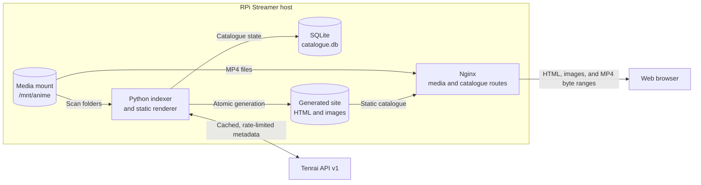

# RPi Streamer

RPi Streamer is a small, local-network media catalogue for personal MP4
collections. Nginx serves the media files with HTTP byte-range support so a
browser can seek and stream without downloading an entire file first. A
periodic Python indexer scans the library, stores its catalogue in SQLite,
enriches anime folders with metadata, and generates static HTML pages for
Nginx to serve.

The project is intended to run comfortably on a Raspberry Pi. It does not
transcode video, manage users, or expose a public internet service.

> **Project status:** Version 0.1.0rc1 is a release candidate. The complete
> streaming, scanning, metadata, static generation, native systemd, and
> Compose implementation is available. Release acceptance on Raspberry Pi
> arm64 and amd64 Linux remains before the first stable tag. Architectural
> choices are recorded in [docs/adr](docs/adr/README.md). The active
> multi-work folder mapping design is tracked in [PLAN.md](PLAN.md).

## Goals

- Stream existing `.mp4` files through Nginx, including browser seeking.
- Browse folders, series, related titles, genres, and locally available
  episodes from generated pages.
- Detect additions, changes, moves, and removals during periodic scans.
- Cache catalogue and metadata state in SQLite.
- Fetch anime details, cover art, episode information, genres, and
  prequel/sequel relationships without requiring a MyAnimeList login.
- Run as a native systemd service or in containers.
- Configure the same application with an INI file and environment variables.
- Continue serving the last successful catalogue when scanning or metadata
  lookup fails.

## Non-goals

- Video transcoding, remuxing, or adaptive-bitrate streaming.
- Authentication, authorization, or safe exposure to the public internet.
- Editing a MyAnimeList account or watch history.
- Downloading copyrighted media.
- A heavy, always-running application web framework.

MP4 browser compatibility still depends on the codecs in each file. Nginx can
serve any MP4, but common browser-compatible combinations such as H.264 video
and AAC audio provide the broadest playback support.

## Architecture


```mermaid
flowchart LR
    browser[Web browser]
    tenrai[Tenrai API v1]

    subgraph host[RPi Streamer host]
        media[(Media mount<br/>/mnt/anime)]
        indexer[Python indexer<br/>and static renderer]
        database[(SQLite<br/>catalogue.db)]
        site[(Generated site<br/>HTML and images)]
        nginx[Nginx<br/>media and catalogue routes]

        media -->|Scan folders| indexer
        indexer -->|Catalogue state| database
        indexer -->|Atomic generation| site
        media -->|MP4 files| nginx
        site -->|Static catalogue| nginx
    end

    indexer <-->|Cached, rate-limited metadata| tenrai
    nginx -->|HTML, images, and MP4 byte ranges| browser
```

Nginx is the data plane: it handles large files, MIME types, conditional
requests, and byte ranges efficiently. Python is the control plane: it scans
and generates pages, but is not in the video path. Static generation is
preferred over FastAPI because the catalogue changes infrequently and requires
no authentication or per-user state. A dynamic API can be added later without
changing media URLs.

The implementation uses the public, read-only
[Tenrai API v1](https://tenrai.org/) as the default metadata transport. Tenrai
is an authless unofficial MyAnimeList API whose v1 contract is compatible with
Jikan v4. The legacy Jikan endpoint remains an explicit rollback option.
RPi Streamer sends at most one request per second per process, uses a
descriptive user agent and 10-second timeout, persists fetched responses,
honors transport-specific `ETag`/`Last-Modified` validators, and makes at most
three attempts with bounded backoff for `429` and transient `5xx` responses.
Metadata availability is never required for local playback.

### Metadata matching and caching

New, unpinned folders are searched by their display title. Matching normalizes
Unicode, case, punctuation, and whitespace, then scores the canonical and
alias titles. A candidate must score at least `0.88` and lead the next result
by at least `0.08`; otherwise the title remains visibly unmatched rather than
being assigned speculatively. Equal top results are always ambiguous.
When a long title has no confident match, one bounded retry drops its final
word and ranks the combined candidates. This handles near-canonical folder
names such as `... Tsurasugi` versus MAL's `... Tsurasugiru` without lowering
the safety threshold globally.

The selected anime's title, synopsis, episode count and episode rows, aliases,
genres, anime relations, raw diagnostic response, validators, and cover
reference are stored in SQLite. Fresh records make no network request. Records
older than `metadata_refresh_interval` are refreshed conditionally; a `304`
advances the cache timestamp without replacing normalized data. Switching
between Tenrai and Jikan reuses normalized records and MAL IDs but does not
send validators obtained from one host to the other. Set
`metadata_provider = jikan` for rollback or `none` for entirely offline scans.

`metadata_language` selects the cached canonical title when the provider supplies a
matching English (`en`/`eng`) or Japanese (`ja`/`jp`/`jpn`) alias, falling back
to the provider's default title. A sidecar `mal_id` bypasses search and confidence
matching. `metadata_enabled = false` prevents all metadata requests for that
folder.

Match decisions are logged with the local path, provider, selected ID and
score, or a reason such as no results, below threshold, ambiguity, or a pinned
sidecar. Provider failures are reported separately. For the reported Okinawa
title, the deterministic override is:

```ini
[rpi-streamer]
mal_id = 55842
```

When enabled, covers are limited to HTTP(S), known image MIME types, and 5 MiB.
They are atomically cached under `state_dir/artwork`; a failed download stores
a missing-art marker for the renderer's future placeholder. Provider,
payload, and artwork errors are isolated per title and included in the scan's
`partial` summary. Previously cached metadata and all local media remain
available.

## Expected library layout

The scanner treats each directory containing one or more `.mp4` files as a
title. The extension match is case-insensitive, so `.MP4` is accepted. A
folder name is converted into its candidate title by replacing dots and
underscores with spaces and collapsing whitespace; other punctuation is
retained. Nested title directories are supported. Media filenames use
case-insensitive natural order, so `2.mp4` sorts before `10.mp4`.

```text
/mnt/anime/
├── Cowboy Bebop/
│   ├── 01 - Asteroid Blues.mp4
│   ├── 02 - Stray Dog Strut.mp4
│   └── rpi-streamer.ini        # optional per-title overrides
└── Neon Genesis Evangelion/
    ├── S01E01.mp4
    └── S01E02.mp4
```

Folder names are used as search hints, not unquestioned identities. The
original filename remains the authoritative episode label. The scanner also
stores conservative hints for a leading number or range, `S01E02` and episode
ranges, and `OVA`/`OAD`/`ONA`/`Special` forms. It does not infer an episode
number from an arbitrary number embedded in a title.

### Optional OpenAI fallback

Set `openai_fallback_enabled = true` to use `gpt-5.6-luna` for three bounded
jobs. Title normalization runs only after a new title fails the pinned,
cached, and deterministic provider matching paths. Episode inference runs
independently whenever filenames have no deterministic episode hint, including
for pinned and already cached titles. Multi-work mapping runs last, only for
files unresolved by manual and deterministic mapping. Title/episode inference
uses the original v1 schema; multi-work mapping uses a separate versioned
schema. A normalized title is only a new metadata search query: its candidate
must still pass the existing score and ambiguity checks. Multi-work output can
select only IDs from the request’s Tenrai-verified candidate enum. It cannot
invent candidates, and a manual `mal_id` remains authoritative.

Only the bounded collection/directory name and at most 50 unresolved MP4
basenames are sent to OpenAI. A multi-work request also contains parsed
filename facts and at most 12 verified candidate summaries: MAL ID, preferred
title, media type, episode count, relation/distance, and order. MP4 contents,
absolute paths, sidecar text, SQLite rows, API keys, synopsis text, artwork,
and raw provider payloads are not included in prompts. Requests use the
[Responses API](https://developers.openai.com/api/reference/resources/responses/methods/create)
with `store = false`, strict Structured Outputs, a 2,000-token output ceiling,
a 128 KiB response ceiling, a 30-second default timeout, and a per-scan call
budget. Authentication, quota, timeout, refusal, malformed output, and
provider failures are non-fatal.

Validated results, including stable `null`/uncertain decisions, are cached in
SQLite by a SHA-256 digest of the bounded input, candidate versions, sidecar
rules, model, and schema version. The default cache lifetime is 90 days, so
ordinary `SIGHUP` rescans do not repeatedly incur API usage. Transient
failures enter a short cooldown rather than consuming another call
immediately. The existing per-scan call budget is shared by all inference
jobs. Oversized collections are handled in deterministic 50-file batches with
at most one new mapping call per collection per scan.

Filename-derived episode hints remain separate and take precedence; a model
hint is displayed only at confidence `0.8` or higher. Multi-work mappings
require confidence `0.85`, exact/complete filenames, a verified candidate ID,
valid kind/range, and compliance with a known provider episode count. Manual
and deterministic mappings are never overwritten. Accepted mappings store
`model`, schema, confidence, and input digest; uncertain or rejected files
remain playable and unmapped.

An optional UTF-8 `rpi-streamer.ini` in a title directory supports collection
metadata, multiple verified works, and exact file overrides. The original
single-work form remains valid:

```ini
[rpi-streamer]
display_title = Cowboy Bebop
sort_title = Bebop, Cowboy
metadata_enabled = true
mal_id = 1
```

All root keys are optional. `display_title` and `sort_title` must be non-empty
when present, `metadata_enabled` uses the main configuration’s boolean forms,
and `mal_id` is the primary positive MAL anime ID. `related_mal_ids` is an
optional comma-separated candidate list:

```ini
[rpi-streamer]
display_title = MF Ghost
mal_id = 50695
related_mal_ids = 12345, 67890

[work "season-1"]
mal_id = 50695
local_episode_range = 1-12
order = 10

[work "season-2"]
mal_id = 12345
local_episode_range = 13-24
episode_offset = -12
order = 20

[work "season-3"]
mal_id = 67890
local_episode_range = 25-37
episode_offset = -24
order = 30
```

Only `50695` in this example is a real verified ID; replace the related
placeholder IDs with the IDs returned by Tenrai/MAL for your collection.

Each `[work "NAME"]` requires `mal_id`. Optional selectors are `files`
(multiline case-insensitive basename globs), `season`, and
`local_episode_range`; all supplied selectors must match. `episode_offset` is
applied after matching. Optional output fields are `label`, `kind`, and
non-negative `order`. A selectorless rule is permitted only for the primary
work and is used only as a safe single-work fallback.

Use `[media "NAME"]` for an exception. Its `file` is an exact,
case-sensitive basename—not a path—and wins over every work rule:

```ini
[media "battle-digest"]
file = AnimePahe_MF_Ghost_Battle_Digest.mp4
mal_id = 54321
kind = summary
label = Battle Digest

[media "special-1"]
file = AnimePahe_MF_Ghost_Special_01.mp4
mal_id = 98765
kind = special
episode = 1
```

The exact-override IDs above are placeholders and must likewise be replaced
with verified IDs.

Media overrides also accept `episode_end`; it requires `episode` and cannot be
smaller. Supported kinds are `episode`, `movie`, `ova`, `oad`, `ona`,
`special`, `summary`, and `unknown`. Episode endpoints are 1–9,999, offsets
are −9,999–9,999, and order is 0–10,000. The parser permits at most 12 work
sections, 50 exact overrides, 12 distinct candidate IDs, eight globs per work,
256 characters per glob, and 2,048 glob characters overall. Section names,
labels, basenames, and total sections are bounded as described in
[`docs/MULTI_WORK_THREAT_MODEL.md`](docs/MULTI_WORK_THREAT_MODEL.md).

Every declared ID must already be cached or verify through the configured
Tenrai/Jikan-compatible anime endpoint. During an outage, uncached rules stay
pending and the previous valid mapping is retained. Exact overrides take
precedence over work rules; two matching work rules are a scan error and do
not replace the last valid mapping. Rule changes are digest-reconciled, so
unchanged mapping rows remain stable and removed rules delete only their own
derived mappings. Unknown sections/keys, missing exact files, unsafe or
unmatched globs, and malformed values make the scan partial without rewriting
the media tree or discarding prior sidecar-derived state.

### Related-work candidate discovery

After the primary work and manual candidates are verified, the indexer can
discover additional candidates from cached Tenrai/Jikan-compatible anime
relations. It follows only sequel, prequel, side story, parent story, spin-off,
summary, alternative version, and reviewed `other` links. Direct sequel links
are considered first. Traversal is cycle-safe and limited to depth 3 and 12
total works per collection, including the primary and manual candidates.
Manga and other non-anime identities, unsupported relation types, and
non-`jikan` identity namespaces are ignored.

Graph expansion runs only when cheap evidence suggests a multi-work
collection: an explicit manual candidate, season number above one, reset
episode numbering, local file count/number beyond the primary episode count,
a Movie/OVA/OAD/ONA/Special/Digest/Summary marker, or a relevant cached
provider relation. Ordinary single-work folders do no relation fetches.

Normalized provider records are the candidate cache. Missing related IDs are
fetched lazily through the same configured provider, sharing its throttling
and retry policy. Cached graphs continue to work offline. A transient failure
makes the scan partial and retains earlier verified candidate associations;
the model is never used to discover or verify MAL IDs. Relation-derived
associations record their source and distance from the primary work.

### Deterministic multi-work mapping

The scanner maps files after manual rules and verified related-work discovery.
Filename facts are parsed independently from the labels shown in the player:
explicit season, episode or range, special kind, ordinal, and normalized
basename markers. Supported strong signals include `S02E03`, `Season 2`,
`2nd Season`, episode ranges, Movie, OVA, OAD, ONA, Special, Summary, and
Digest. Common release noise such as `1080p`, years, codecs, release-group
text, and repeated `.mp4` suffixes is not treated as episode evidence.

Continuous numbering is split only when the files form a complete contiguous
sequence and exactly one ordered prefix of verified candidate episode counts
matches its endpoint. Thus a 12+12+13 sequel chain can safely map local
episodes 1–37 to provider episodes 1–12, 1–12, and 1–13. Reset numbering uses
an explicit season marker and verified sequel order; unmarked files become
season 1 only when the same folder contains a later explicit season.

Manual exact overrides and work rules always win. Known provider episode
counts are enforced, ranges may not cross a work boundary, and duplicate,
incomplete, non-contiguous, or otherwise non-unique layouts remain ambiguous
or unmapped for later manual/model handling. Ambiguous and invalid decisions
make the scan partial rather than silently attaching the wrong metadata.
Deterministic rows store their source, parser/mapping schema, and a digest of
the filename facts, candidates, provider counts, and sidecar rules. A rename,
count refresh, or rule edit therefore recomputes only affected results.

### Model-assisted multi-work mapping

When the OpenAI fallback is enabled, only files left unresolved by the
deterministic pass are eligible. One strict Structured Outputs entry is
required for every submitted basename. The selected MAL ID must be one of the
verified works supplied with that request or `null`; the model is explicitly
instructed to prefer `null` over guessing. Application validation repeats the
candidate, filename, kind, episode-range, confidence, and provider-count
checks after schema validation.

Cached uncertain results prevent repeated spending on inherently ambiguous
files. A filename, provider refresh, candidate change, model/schema change, or
sidecar-rule edit changes the privacy-preserving digest and permits a fresh
decision. Timeouts, refusals, quota/rate-limit responses, malformed output,
and invalid mappings are non-fatal: the scan records a bounded issue and the
file remains playable. Add an exact `[media "..."]` override or `[work "..."]`
rule whenever an automatic answer is undesirable; it takes effect before any
later model request.

The conventional `lost+found` directory is ignored only when it is directly
under `media_root`, preventing an ext filesystem recovery directory from
making every scan partial. A nested directory with that name is treated
normally. Directory symlinks are not traversed. File symlinks are catalogued only when
their resolved target remains inside `media_root`; escaping links are reported
and skipped. Duplicate links to the same filesystem object are skipped. The
scanner only reads the media tree and never creates sidecars or other files in
it.

## Generated catalogue

The implemented UI is server-rendered static HTML with one small,
dependency-free local JavaScript controller and no frontend build tool, CDN,
or request-time Python process:

- a home page with title cards, cover images, and scan status;
- a folder/title page with metadata and locally available MP4 episodes;
- genre pages and links between known prequels and sequels;
- semantic breadcrumbs and primary navigation;
- one HTML5 `<video controls preload="metadata">` player per title page;
- Previous/Next buttons and a work-grouped episode dropdown that change its
  source without autoplaying, including across season and tie-in boundaries;
- compact cards for associated works and provider episode context per work;
- an explicit `Unmapped` group that keeps uncertain files visible and
  playable;
- graceful placeholders when metadata or artwork is unavailable.

The first local episode remains playable without JavaScript, and a `<noscript>`
list groups direct links to every other local episode. Native `<optgroup>`
labels expose work boundaries to assistive technology and keyboard users
without introducing custom controls. A fragment such as `#episode-3` selects
an episode when JavaScript is available; its flat position can cross a group
boundary. The selected work and provider episode title are shown beside the
player. Provider episode rows are shown in per-work reference tables and never
imply local availability.
All user-controlled filenames and remote text are HTML-escaped. Every media
path segment is URL-encoded and rooted below `/media/`; remote artwork URLs are
never emitted into pages.

Title pages use database-identity slugs such as
`titles/title-00000001.html`, independent of display titles. Genre pages use a
readable prefix plus a hash suffix to prevent normalization collisions. A
generated tree looks like:

```text
site/
├── index.html
├── assets/
│   ├── style-<content-hash>.css
│   └── covers/
│       └── jikan-1-<content-hash>.jpg
├── titles/title-00000001.html
└── genres/
    ├── index.html
    └── sci-fi-96dee9f018.html
```

For example, a local file is rendered as a native browser player with an
encoded Nginx media route:

```html
<video controls preload="metadata"
       src="/media/Cowboy%20Bebop/01%20-%20Asteroid%20Blues.mp4">
  <p>Your browser cannot play this video.</p>
</video>
```

Generation happens in a sibling staging directory. Required output is
validated before the complete tree is atomically renamed to `site_dir`. On
subsequent successful builds, the formerly published tree is retained as
`<site_dir>.previous`. Rendering, validation, and publication failures leave
the currently published site intact. Output bytes are deterministic when the
catalogue and cached assets are unchanged.

CSS, JavaScript, and validated cover images have content-derived filenames. This lets Nginx
cache them as immutable for a year without serving stale content after a
change. HTML retains stable URLs and is always revalidated.

## Installation for development

RPi Streamer requires Python 3.11 or newer and currently has no runtime
dependencies. From an activated virtual environment:

```bash
python -m pip install -e '.[dev]'
rpi-streamer --help
```

The `dev` extra installs pytest, Ruff, and mypy. An editable install without
development tools is `python -m pip install -e .`.

## Configuration

Native installations read `/etc/rpi-streamer/rpi-streamer.ini`. A different
file can be selected with `RPI_STREAMER_CONFIG` or the higher-precedence
`--config PATH` CLI option. Setting values use this precedence:
environment variable, INI value, built-in default. The example file is
[`config/rpi-streamer.ini.example`](config/rpi-streamer.ini.example).

The implemented schema is:

```ini
[rpi-streamer]
media_root = /mnt/anime
state_dir = /var/lib/rpi-streamer
site_dir = /var/lib/rpi-streamer/site
database_path = /var/lib/rpi-streamer/catalogue.db
scan_interval = 1h
metadata_provider = tenrai
metadata_refresh_interval = 30d
metadata_language = en
download_artwork = true
openai_fallback_enabled = false
openai_api_key =
openai_model = gpt-5.6-luna
openai_timeout = 30s
openai_max_calls_per_scan = 3
openai_cache_ttl = 90d
log_level = INFO
```

| INI key | Environment override | Purpose |
|---|---|---|
| `media_root` | `RPI_STREAMER_MEDIA_ROOT` | Read-only root containing the collection |
| `state_dir` | `RPI_STREAMER_STATE_DIR` | Persistent application state |
| `site_dir` | `RPI_STREAMER_SITE_DIR` | Atomically published static catalogue |
| `database_path` | `RPI_STREAMER_DATABASE_PATH` | SQLite database file |
| `scan_interval` | `RPI_STREAMER_SCAN_INTERVAL` | Delay between automatic scans; `0` disables them |
| `metadata_provider` | `RPI_STREAMER_METADATA_PROVIDER` | `tenrai` (default), `jikan` rollback, or `none` |
| `metadata_refresh_interval` | `RPI_STREAMER_METADATA_REFRESH_INTERVAL` | Maximum metadata cache age |
| `metadata_language` | `RPI_STREAMER_METADATA_LANGUAGE` | Preferred display-title language |
| `download_artwork` | `RPI_STREAMER_DOWNLOAD_ARTWORK` | Cache covers locally |
| `openai_fallback_enabled` | `RPI_STREAMER_OPENAI_FALLBACK_ENABLED` | Enable model-assisted title/episode inference |
| `openai_api_key` | `RPI_STREAMER_OPENAI_API_KEY` | OpenAI API key; environment overrides INI |
| `openai_model` | `RPI_STREAMER_OPENAI_MODEL` | Responses API model; defaults to `gpt-5.6-luna` |
| `openai_timeout` | `RPI_STREAMER_OPENAI_TIMEOUT` | Per-request timeout |
| `openai_max_calls_per_scan` | `RPI_STREAMER_OPENAI_MAX_CALLS_PER_SCAN` | Paid-call budget for one scan |
| `openai_cache_ttl` | `RPI_STREAMER_OPENAI_CACHE_TTL` | Successful/uncertain inference cache lifetime |
| `log_level` | `RPI_STREAMER_LOG_LEVEL` | Application log verbosity |

Durations accept a non-negative integer with an optional `s`, `m`, `h`, or `d`
suffix; a bare integer is seconds. Boolean values accept
`1/0`, `true/false`, `yes/no`, and `on/off`, case-insensitively.

Configuration validation currently enforces:

- an existing, readable, absolute media root;
- absolute, distinct state/site/database paths with writable existing
  ancestors;
- state, site, and database paths outside the media root;
- `tenrai`, `jikan`, or `none` as the metadata provider;
- a positive metadata refresh interval and a non-negative scan interval;
- a key, positive timeout/call budget, valid model name, and positive cache
  lifetime when the OpenAI fallback is enabled;
- a short language identifier and a standard Python log level;
- known INI sections and keys, so misspellings fail at startup.

An explicitly selected config file must exist. The default file is optional,
allowing environment-only container configuration. `validate-config` emits the
normalized configuration as sorted JSON and returns exit code `2` for a
configuration error:

```bash
rpi-streamer --config ./config/rpi-streamer.ini.example validate-config
RPI_STREAMER_CONFIG=/path/to/rpi-streamer.ini rpi-streamer validate-config
```

Tenrai is used by default for new configuration files. Existing native INI
files are intentionally preserved by `make update`, so set the provider
explicitly when upgrading:

```ini
[rpi-streamer]
metadata_provider = tenrai
```

Then run `sudo systemctl reload rpi-streamer`. To roll back without changing
the database, set `metadata_provider = jikan`; to suppress remote metadata
requests entirely, set it to `none`. All three modes retain local playback and
the last cached metadata.

`validate-config` never prints the API key; it emits `[configured]` instead.
Keeping the key in `/etc/rpi-streamer/rpi-streamer.ini` is supported. Native
installation/update sets that file to `root:rpi-streamer` mode `0640`, allowing
the unprivileged service to read it without making it world-readable:

```ini
[rpi-streamer]
openai_fallback_enabled = true
openai_api_key = sk-proj-...
```

The normal backup archive includes this INI file, so protect backup files as
credentials too. For containers, prefer supplying
`RPI_STREAMER_OPENAI_API_KEY` at runtime and do not commit it to Compose,
Dockerfiles, or `.env`.

## Process lifecycle

The indexer performs a scan at startup and then waits for the configured
interval:

- `SIGHUP` requests an immediate rescan (coalesced if one is already running);
- if `SIGHUP` arrives during a scan, exactly one follow-up scan runs;
- `SIGTERM` and `SIGINT` request shutdown after the active atomic scan cycle;
- a failed scan is logged and retried later while the previous generated site
  remains available.

Scheduling uses a monotonic clock, so wall-clock corrections do not cause
unexpected scans. `scan_interval = 0` keeps the startup and signal-triggered
scans but disables timed scans. An advisory lock at
`state_dir/indexer.lock` prevents `serve` and one-shot `scan` processes from
modifying the same state concurrently.

The installed CLI provides the planned foreground and one-shot command names:

```text
rpi-streamer serve
rpi-streamer scan
rpi-streamer validate-config
rpi-streamer healthcheck
rpi-streamer render-nginx --listen HOST:PORT --output PATH
```

All commands are operational. `scan`
creates/migrates the configured database, reconciles and enriches the
collection, atomically regenerates `site_dir`, prints a compact scan/page
summary, and returns `0` for a complete scan or `3` for a partial scan or
generation failure. Use `rpi-streamer scan --json` for a single-line,
machine-readable result. `serve` runs in the foreground for systemd or a
container. Argument/config errors return `2`; operational failures and partial
one-shot scans return `3`; lock contention returns `4`.

Service logs use concise `key=value` fields suitable for journald, including
`event`, `scan_id`, status, title/file/error counts, and generated page count.
Partial scans additionally emit `event=scan_issues` with a bounded, sanitized
summary identifying unreadable paths, invalid sidecars, and metadata failures.
Remote payloads are never logged and error values have control characters
removed. The atomically replaced `state_dir/status.json` health artifact
contains the PID, state (`starting`, `scanning`, `ready`, `degraded`, or
`stopped`), update time, and the latest successful summary when applicable.
A failed cycle publishes `degraded` and its sanitized error; a later
successful cycle returns it to `ready`.

For systemd, `systemctl reload rpi-streamer` will send `SIGHUP`. Scans will also
be triggerable with `kill -HUP "$(pidof rpi-streamer)"` where appropriate.

## Nginx streaming setup

Native installation renders Nginx from the same resolved configuration as the
indexer, so `media_root` and `site_dir` cannot drift. To inspect a candidate
without installing it:

```bash
rpi-streamer --config /etc/rpi-streamer/rpi-streamer.ini render-nginx \
  --listen 192.168.11.111:80 --output /tmp/rpi-streamer.conf
```

The renderer accepts absolute paths with spaces and rejects control characters
and Nginx-significant path characters. The installer publishes the candidate,
runs `nginx -t`, and restores the previous site configuration if validation
fails.

Choose the host's actual private-LAN address; do not use `0.0.0.0` unless a
firewall restricts the port to trusted subnets. Do not port-forward the
service. The Nginx worker needs read and directory-traverse permission on the
generated site and media tree, but neither path needs to be writable by Nginx.
The media and site paths must be absolute, and the trailing slashes shown above
are significant for `root`/`alias` mapping.

Nginx serves only `.mp4` paths below `/media/`, blocks dotfiles and directory
listing, refuses media symlinks, and leaves byte-range handling to its normal
static-file module. There is no `mp4` pseudo-streaming directive and no
transcoding. HTML receives `Cache-Control: no-cache`; content-fingerprinted
CSS/covers receive a one-year immutable policy; media is revalidated. The
`/healthz` endpoint reports whether Nginx itself can answer requests. The
indexer's richer state remains in `state_dir/status.json`.

Useful checks after deployment are:

```bash
curl -i http://192.168.1.20:8080/healthz
curl -I http://192.168.1.20:8080/
curl -i -H 'Range: bytes=100-199' \
  'http://192.168.1.20:8080/media/Cowboy%20Bebop/01.mp4'
```

The range request should return `206 Partial Content`, a `Content-Range`
header, and exactly 100 bytes. An unsatisfiable range should return `416`.
If catalogue pages return `404`, confirm that a successful scan has generated
`site_dir` and that the configured path matches it. For media `403`/`404`
responses, inspect every parent directory's traverse permission and confirm
the file is a regular, non-symlinked MP4 under `media_root`. Use `nginx -T` to
inspect the effective configuration. Successful delivery with failed browser
playback usually indicates an unsupported codec rather than a range problem.
The generated catalogue remains fully browsable when the Python indexer is
stopped because Nginx reads only the last published static tree.

## Native Debian/Raspberry Pi OS deployment

Run all Make commands from the repository root. The Makefile uses the active
`python3` by default and never assumes a virtual-environment name. Override it
with an absolute interpreter when desired. On a clean Debian 12 or Raspberry
Pi OS Bookworm host:

```bash
sudo apt update
sudo apt install python3 python3-venv nginx
python3 -m venv /opt/rpi-streamer-env
sudo chown "$USER" /opt/rpi-streamer-env
/opt/rpi-streamer-env/bin/python -m pip install --upgrade pip
make install PYTHON=/opt/rpi-streamer-env/bin/python \
  LISTEN=192.168.11.111:80 MEDIA_ROOT=/mnt/media
```

`make install` builds into `deployment/dist/`, installs the wheel with the
selected interpreter before sudo, and passes that environment's console script
to the systemd installer. It preserves an existing INI and state. Review the
configuration before enabling services:

```bash
sudoedit /etc/rpi-streamer/rpi-streamer.ini
make validate PYTHON=/opt/rpi-streamer-env/bin/python
sudo systemctl enable --now rpi-streamer nginx
```

An activated environment works with plain `make install` only when its entire
path is traversable by the `rpi-streamer` system account. A typical
`/home/USER` mode of `0700` deliberately prevents that account from reaching a
virtual environment below the home directory. The installer reports this
condition and does not weaken home permissions. Use an environment below
`/opt`, as in the example, for the systemd service. A system Python can also be
selected, but distributions enforcing PEP 668 may reject installation; create
a venv instead of using `--break-system-packages`.

`ProtectHome=read-only` prevents service writes below home directories but
does not override normal Unix traversal permissions. A home environment may
still be useful for development and building the wheel; it need not be the
environment used by the installed service.

The installed layout is:

```text
/etc/rpi-streamer/rpi-streamer.ini
/etc/nginx/sites-available/rpi-streamer.conf
/etc/systemd/system/rpi-streamer.service
/opt/rpi-streamer-env/       # example; the selected environment is configurable
/var/lib/rpi-streamer/
```

An existing INI is never overwritten during installation or upgrade. The
installer creates the `rpi-streamer` system account, state directory, unit,
Nginx site, and adds Debian's `www-data` account to the `rpi-streamer` group.
The latter change takes effect after Nginx is restarted.

### Media and generated-site permissions

Both the indexer and Nginx need read permission and directory traversal on the
media tree; neither needs write permission there. One suitable ownership model
is a trusted administrator as owner and `rpi-streamer` as the reader group:

```bash
sudo chgrp -R rpi-streamer /mnt/media
sudo find /mnt/media -type d -exec chmod 0750 '{}' +
sudo find /mnt/media -type f -exec chmod 0640 '{}' +
namei -l /mnt/media
sudo -u rpi-streamer find /mnt/media -type f -name '*.mp4' -print -quit
sudo -u www-data find /mnt/media -type f -name '*.mp4' -print -quit
```

Review these recursive permission commands before using them if the mount is
shared with other applications. Group membership avoids making the collection
world-readable or writable. The whole service filesystem is read-only under
`ProtectSystem=strict`, with only
`/var/lib/rpi-streamer` admitted through `ReadWritePaths`. `StateDirectory`
creates that path as `rpi-streamer:rpi-streamer` mode `0750`, and `UMask=0027`
makes generated pages group-readable for Nginx.

Start the services after the checks:

```bash
sudo systemctl enable --now rpi-streamer nginx
systemctl status rpi-streamer --no-pager
curl -i http://192.168.1.20:8080/healthz
```

Normal lifecycle and diagnostics are:

```bash
sudo systemctl start rpi-streamer
sudo systemctl stop rpi-streamer
sudo systemctl restart rpi-streamer
sudo systemctl reload rpi-streamer
sudo systemctl is-enabled rpi-streamer
journalctl -u rpi-streamer -n 100 --no-pager
journalctl -u rpi-streamer -f
systemctl show rpi-streamer -p User -p Group -p ReadWritePaths
```

`reload` sends `SIGHUP` and requests a scan without interrupting the active
one. Unexpected exits are restarted after ten seconds; deliberate stops are
not. Startup waits for `network-online.target` so metadata refreshes do not
race basic network configuration. A long active scan receives up to five
minutes to finish cleanly during shutdown.

### Upgrade, backup, rollback, and uninstall

From the updated repository root, `make update` reads the current systemd unit
and upgrades that service environment. It also preserves the installed Nginx
listen address unless `LISTEN` is explicitly supplied. The caller's active
environment is used to build the wheel, but it does not silently replace an
existing service environment. Building and dependency resolution remain
unprivileged; only installation into the normally root-owned production
environment runs through `sudo`:

```bash
make update
make validate PYTHON=/opt/rpi-streamer-env/bin/python
```

The locally built wheel is reinstalled even when its package version matches
the installed version. This ensures fixes made between release-candidate builds
are deployed rather than skipped by pip's normal upgrade comparison.

If the indexer is running, the update stops it before backup and keeps it
stopped throughout wheel construction, package replacement, unit/Nginx
installation, and validation. A shell trap restarts it after any failed update;
a successful update starts it only if it was running beforehand. This avoids
loading Python code and packaged templates from different versions during an
in-place upgrade.

Use `SERVICE_EXECUTABLE=/absolute/path/bin/rpi-streamer` to intentionally move
or override the installed environment, and `LISTEN=HOST:PORT` to intentionally
change the listener. For an older installation, the executable under
`/opt/rpi-streamer/venv` is detected from its existing unit. Its INI, SQLite
database, generated site, and service enablement are retained. Set
`media_root = /mnt/media` before the update. Nginx is regenerated from that
INI, and a failed syntax check restores the previous site configuration. On
an existing installation, `MEDIA_ROOT` does not override the preserved INI.

For a consistent backup, briefly stop writes and archive the complete state
(database, artwork, status, and last generated site):

```bash
sudo systemctl stop rpi-streamer
sudo tar -C /var/lib -czf rpi-streamer-backup.tgz rpi-streamer
sudo systemctl start rpi-streamer
```

To restore, stop the service, move the current state aside, extract the archive
under `/var/lib`, restore `rpi-streamer:rpi-streamer` ownership, and start the
service. A version rollback uses the same installer with an older wheel.
Database migrations are forward-only, so restore the backup taken before an
upgrade if the older version does not understand the newer schema.

To uninstall service assets while retaining the collection, configuration,
state, environment, and account:

```bash
make uninstall
```

`/etc/rpi-streamer`, `/var/lib/rpi-streamer`, and the system account are
deliberately retained for recovery. Remove them only after verifying a backup.
The media collection is never removed by the installer or these commands.

This is intentionally a trusted-LAN design. Operators should use a firewall and
must not port-forward it to the internet without adding authentication, TLS,
request limits, and a separate security review.

## Container deployment

The Compose deployment builds two pinned, small images:

- `indexer` runs as UID/GID `10001`, scans `/media` read-only, and owns the
  persistent `/state` volume;
- `nginx` runs as UID `101` with the indexer's shared GID `10001`, and mounts
  both `/media` and `/state` read-only.

Both root filesystems are read-only, capabilities are dropped, and
`no-new-privileges` is set. Only explicit tmpfs and state mounts are writable;
there is no privileged mode, host namespace, or Docker socket access.

Docker Engine with the Compose v2 plugin is required. Choose any readable host
media directory and ensure directories are traversable by container users.
Files need only be readable; they are never modified:

```bash
export RPI_STREAMER_MEDIA_PATH=/mnt/anime
find "$RPI_STREAMER_MEDIA_PATH" -type d -exec chmod a+rx {} +
find "$RPI_STREAMER_MEDIA_PATH" -type f -name '*.mp4' -exec chmod a+r {} +
docker compose config --quiet
docker compose up -d --build --wait
curl -i http://127.0.0.1:8080/healthz
```

The defaults publish on all interfaces at port `8080`. Override the host path,
LAN binding, and application settings in the shell or a project `.env` file:

| Variable | Default | Purpose |
|---|---|---|
| `RPI_STREAMER_MEDIA_PATH` | `./media` | Arbitrary host collection path |
| `RPI_STREAMER_BIND_ADDRESS` | `0.0.0.0` | Host address published by Compose |
| `RPI_STREAMER_PORT` | `8080` | Published host port |
| `RPI_STREAMER_VERSION` | `local` | Local image tag and version label |
| `RPI_STREAMER_SCAN_INTERVAL` | `1h` | Periodic rescan interval |
| `RPI_STREAMER_METADATA_PROVIDER` | `tenrai` | Tenrai, Jikan rollback, or offline `none` |
| `RPI_STREAMER_METADATA_REFRESH_INTERVAL` | `30d` | Metadata cache lifetime |
| `RPI_STREAMER_METADATA_LANGUAGE` | `en` | Preferred provider language |
| `RPI_STREAMER_DOWNLOAD_ARTWORK` | `true` | Cache cover artwork |
| `RPI_STREAMER_LOG_LEVEL` | `INFO` | Python service log level |

Container-internal media/state paths are deliberately fixed so both services
agree; do not override them. Inspect health and logs with:

```bash
docker compose ps
docker compose logs -f indexer nginx
docker compose exec indexer rpi-streamer healthcheck
```

The indexer health check accepts a live service in `ready` or `scanning` state.
Nginx checks `/healthz`. A startup grace period allows the initial metadata scan
to finish. Send `SIGHUP` for an immediate scan; ordinary stop signals finish
the current atomic scan before shutdown:

```bash
docker compose kill -s HUP indexer
docker compose stop
docker compose start
```

The named `rpi-streamer_state` volume preserves SQLite, artwork, status, and
generated pages across restarts and image replacements. Upgrade from a clean
checkout with `docker compose build --pull` followed by
`docker compose up -d --wait`. Back up before upgrades because database
migrations are forward-only:

```bash
docker compose stop indexer
docker run --rm \
  -v rpi-streamer_state:/state:ro \
  -v "$PWD":/backup \
  alpine:3.21 tar -C /state -czf /backup/rpi-streamer-state.tgz .
docker compose start indexer
```

To restore into a new empty state volume:

```bash
docker compose down
docker volume create rpi-streamer_state
docker run --rm \
  -v rpi-streamer_state:/state \
  -v "$PWD":/backup:ro \
  alpine:3.21 sh -c \
  'tar -C /state -xzf /backup/rpi-streamer-state.tgz && chown -R 10001:10001 /state'
docker compose up -d --wait
```

`docker compose down` retains the named volume; `docker compose down --volumes`
permanently deletes catalogue state and should only be used after a verified
backup. Media is a bind mount and is never part of that volume.

For registry publication, Buildx Bake records both supported platforms and OCI
provenance inputs:

```bash
VERSION=0.1.0 REVISION="$(git rev-parse HEAD)" \
  CREATED="$(date -u +%Y-%m-%dT%H:%M:%SZ)" \
  docker buildx bake --push
```

The targets are `linux/amd64` and `linux/arm64`. Native builds and the local
end-to-end fixture are verified in this milestone; publishing both
architectures requires a configured multi-platform Buildx builder and registry.

## Data and rescan behavior

The implemented repository uses Python's standard `sqlite3` module without an
ORM. Opening `CatalogueRepository(database_path)` creates the parent directory,
opens the database, applies pending migrations, and exposes typed records
instead of requiring application code to issue SQL.

Schema version 9 contains:

| Table | Stored data |
|---|---|
| `schema_migrations` | Applied forward-only schema versions and UTC timestamps |
| `library_entries` | Title folders, display/sort titles, availability, and metadata overrides |
| `media_files` | Relative MP4 paths, filesystem identity, size/mtime, deterministic and inferred episode hints, and availability |
| `inference_cache` | Digest-keyed structured model results, model/schema version, and timestamp |
| `provider_records` | Reusable normalized work details keyed by provider/MAL ID, cache validators and transport provenance, refresh time, and compact raw detail JSON |
| `library_entry_works` | Collection-to-work associations, primary work, local name/label/order, source, confidence, relation distance, and verification timestamps |
| `media_work_mappings` | Optional file-to-work mapping, media kind/episode range, provenance, confidence, inference model/schema, input digest, and timestamps |
| `library_entry_mapping_state` | Canonical sidecar-rules digest used to invalidate derived mappings without storing configuration secrets |
| `provider_episodes` | Provider episode number, title, air date, filler, and recap flags |
| `aliases` | Provider title aliases by type |
| `genres` / `provider_record_genres` | Case-insensitive normalized genres and title membership |
| `relations` | Prequel, sequel, and other provider relationships |
| `artwork` | Source/cache paths, MIME/size details, and HTTP validators |
| `scan_runs` | Running/completed scan status, counts, summary, and errors |

Media and artwork paths are canonical relative POSIX paths. Absolute paths,
backslashes, `.`/`..`, repeated separators, and NUL bytes are rejected.
Persisted timestamps are timezone-aware and normalized to UTC. Files have a
local identity derived from the filesystem device and inode, allowing a rename
or move on the same mounted filesystem to retain its database row and title
metadata where the match is unambiguous. Size and nanosecond modification time
detect content changes. Videos are not hashed.

Foreign keys and a 5-second busy timeout are enabled on every repository
connection. The repository requests WAL journal mode for normal file-backed
deployments and records the mode SQLite actually returns; SQLite may retain a
safer supported mode for in-memory databases or filesystems where WAL is not
available. Callers can wrap a full scan or metadata update in
`repository.transaction()`. Nested write methods use savepoints, and failed
replacements restore the previous rows.

Migrations are ordered, forward-only, idempotent, and applied transactionally.
A database with a schema newer than the application supports is rejected
instead of being modified. A successful full scan marks missing files and
entries unavailable rather than deleting them, preserving remote metadata and
history. If any directory, file, or sidecar could not be read safely, the scan
is recorded as `partial`: known-good discoveries are updated, but unseen rows
remain available so an unreadable subtree cannot erase the previous
catalogue. Remote calls occur only for new, manually rematched, or stale
titles, and failures do not discard the last cached provider record.

Schema 6 migrates each schema-5 folder metadata match to one primary
collection-work association. Provider records and their episode, alias, genre,
relation, artwork, raw-response, validator, and inference-cache data retain
their identities. Existing files deliberately remain unmapped until the
multi-work reconciliation stage; current pages continue to resolve the
primary association and therefore keep their collection slug, metadata, and
player ordering.

Schema 7 aligns stored mapping kinds with the public sidecar vocabulary and
preserves schema-6 mappings (`recap` becomes `summary`; `other` becomes
`unknown`).

Schema 8 records the bounded relation distance for automatically discovered
candidate associations.

Schema 9 records a parser/mapping schema version on deterministic mappings as
part of their invalidation provenance. Existing deterministic rows migrate
with a `legacy` version marker and are safely recomputed on a later scan.

### Database backup and restore

Generated HTML is disposable, but `catalogue.db` contains mapping and cached
metadata state. For a consistent online backup, use SQLite's backup API or its
CLI `.backup` command rather than copying only the main file while WAL is
active:

```bash
sqlite3 /var/lib/rpi-streamer/catalogue.db \
  ".backup '/path/to/backup/catalogue.db'"
```

Take and retain a verified backup before upgrading a schema-5, schema-6, or
schema-7 installation. Schema normalization is forward-only: an older RPi
Streamer binary cannot read the migrated database, and restoring only the
database while leaving newer generated/state files can produce an inconsistent
rollback.

Alternatively, stop the indexer before copying `catalogue.db` together with
any present `catalogue.db-wal` and `catalogue.db-shm` files. Restore only while
the indexer is stopped, keep a copy of the pre-restore state, and start the
same or newer application version so migrations can run safely.

## Development checks

The source uses a `src/rpi_streamer/` layout and tests live in `tests/`. Run all
implemented checks from the project virtual environment:

```bash
ruff check .
ruff format --check .
mypy
pytest
```

The normal test suite never contacts Tenrai or Jikan. Explicit, low-volume live
smoke tests are available when troubleshooting provider connectivity:

```bash
RPI_STREAMER_LIVE_TENRAI=1 pytest tests/test_metadata.py::LiveTenraiSmokeTest
RPI_STREAMER_LIVE_JIKAN=1 pytest tests/test_metadata.py::LiveJikanSmokeTest
```

`tests/test_nginx.py` always audits the rendered template. When an `nginx`
binary is on `PATH`, it additionally runs `nginx -t`, starts an isolated
loopback server, and verifies catalogue availability, HEAD and conditional
requests, Unicode MP4 URLs, `200`/`206`/`416`, byte-accurate seeking, MIME,
cache headers, and rejection of traversal, dotfiles, symlinks, and non-media
files.

The offline end-to-end fixture runs discovery, mocked metadata enrichment,
SQLite persistence, static generation, an unchanged rescan, and removal
reconciliation. `make acceptance` adds the Nginx syntax and browser-style
range suite when Nginx is installed. Database transaction tests and forced
publication failures verify that interrupted writes retain the previous
database state and published catalogue.

GitHub Actions runs formatting, linting, strict typing, tests, and wheel builds
on Python 3.11–3.13. Separate jobs install Nginx for the streaming integration
suite and build the amd64 container targets. Normal CI and tests remain
network-independent.

## Release and support policy

RPi Streamer uses semantic versions. The 0.1.0 release candidate supports
Python 3.11–3.13,
Debian 12/Raspberry Pi OS Bookworm or newer Linux hosts with systemd and
Nginx, and container deployment on Linux amd64/arm64. Other POSIX systems may
work but are not release-tested. Database migrations are forward-only; back up
before every upgrade and do not downgrade a migrated database.

There are no runtime Python dependencies. Development dependencies have
compatible upper bounds and are reviewed before release. Container base images
are digest-pinned. See [CHANGELOG.md](CHANGELOG.md),
[CONTRIBUTING.md](CONTRIBUTING.md), the
[architecture decisions](docs/adr/README.md),
[security guidance](docs/SECURITY.md), and the
[release checklist](docs/RELEASE_CHECKLIST.md). The checklist includes a
repeatable disaster-recovery exercise and the evidence required on Raspberry
Pi arm64 and amd64 hosts.

Performance depends primarily on directory-entry latency, SQLite storage, and
metadata cache misses rather than MP4 size because videos are not hashed.
Release profiling records title/file count, warm and cold elapsed scan time,
and peak RSS on real Raspberry Pi hardware. No numeric budget is claimed until
the first host measurement establishes an honest baseline.

Known limitations and deferred work:

- trusted-local-network operation only; no authentication or TLS;
- MP4 only, with no transcoding, remuxing, or HLS;
- static pages with no dynamic API or full-text search index;
- Tenrai and Jikan share one Jikan-compatible MAL metadata schema; providers
  with a different schema are not implemented;
- model-assisted inference still depends on provider search/details for
  verified metadata;
- browser playback remains dependent on codecs in the source MP4;
- metadata relationships link locally only when the related provider title is
  already matched in the collection.

Durable design choices and their consequences are recorded as
[architecture decision records](docs/adr/README.md). Current release
acceptance is tracked in the [release checklist](docs/RELEASE_CHECKLIST.md).

## License

Licensed under the Apache License 2.0. See [LICENSE](LICENSE).
